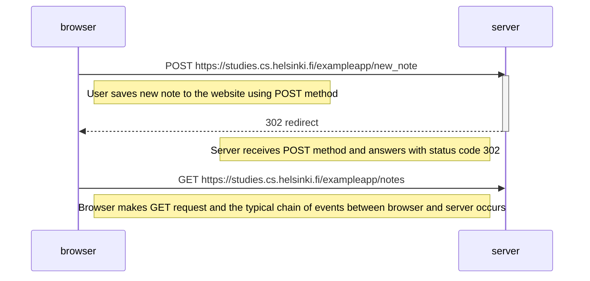

```mermaid
sequenceDiagram
    participant browser
    participant server
    
    browser->>server: POST https://studies.cs.helsinki.fi/exampleapp/new_note
    activate server
    Note right of browser: User saves new note to the website using POST method
    server-->>browser: 302 redirect
    deactivate server
    Note left of server: Server receives POST method and answers with status code 302
    browser->>server: GET https://studies.cs.helsinki.fi/exampleapp/notes
    Note right of browser: Browser makes GET request and the typical chain of events between browser and server occurs
```
